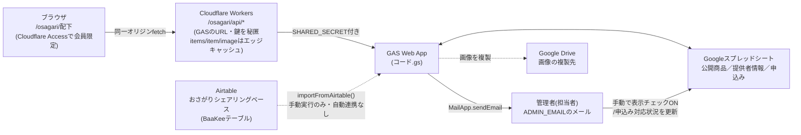
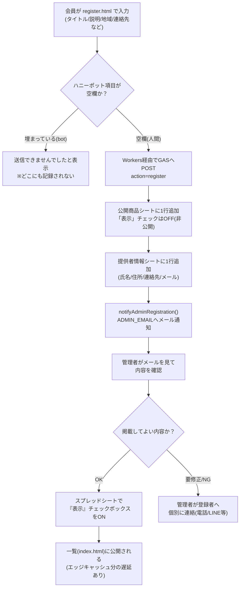
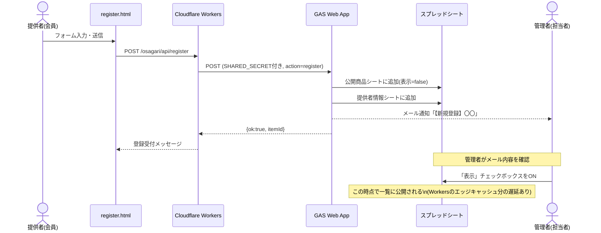
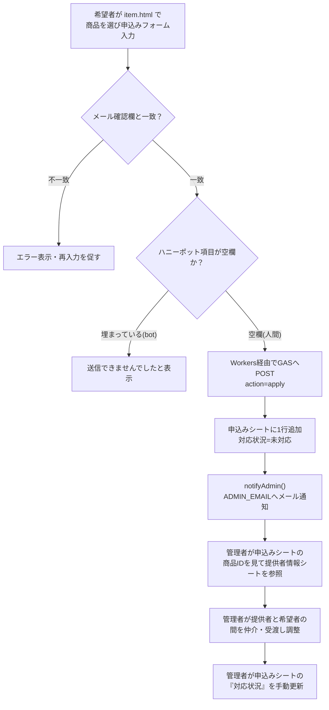
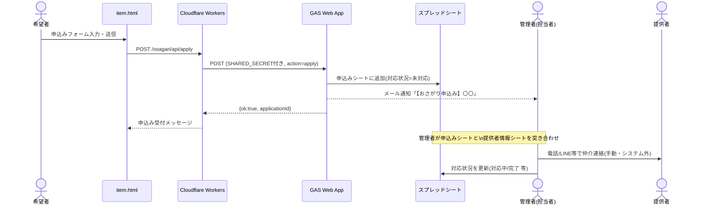
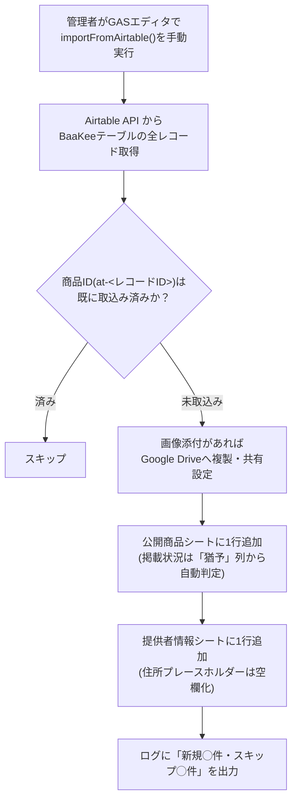

# おさがりシェアリング機能 データ・通知フロー

登録〜申込み〜管理者対応の間に、どのタイミングで誰にメールが飛び、
どのデータがどこ（スプレッドシート／Airtable）に書き込まれるかをまとめる。
実装コードの対応箇所：`gas/コード.gs`（GAS本体）／`workers/osagari-worker.js`（中継）。

## 0. 全体構成

**ポイント**：
- Airtableは常時連携ではなく、GASエディタで `importFromAirtable` 関数を手動実行したときだけ呼ばれる一括インポート用。会員登録・申込みの通常フローにAirtableは登場しない。
- 一覧(`/osagari/api/items`)・詳細(`/osagari/api/item`)・画像(`/osagari/api/image`)はCloudflare Workersのエッジキャッシュを経由する（一覧・詳細は30秒、画像は1日）。登録・掲載状況の変更が一覧に反映されるまで、キャッシュ分＋Cloudflareゾーンのブラウザキャッシュ（最大4時間）のタイムラグが生じうる。

---

## 1. 会員が「モノ・たすけあい」を登録する（register.html）

### フローチャート

### シーケンス図

---

## 2. 希望者が「譲ってほしい／頼みたい」と申し込む（item.html）

### フローチャート

### シーケンス図

**注意（現状の設計）**：希望者・提供者どうしを直接つなげる自動メールは存在しない。管理者が申込みシートと提供者情報シートを見比べて、電話やLINEなど**システム外で手動仲介**する運用（`gas/README.md`に明記されている「提供者情報シートはAPIから一切参照しない＝個人情報を公開しない設計」の裏返し）。

---

## 3. Airtableからの一括インポート（手動運用・GASエディタから実行）

**ポイント**：
- Airtable連携はWebアプリからのリアルタイム連携ではなく、**担当者がGASエディタを開いて手動でボタンを押す**ときだけ動く一括バッチ処理。
- 何度実行しても、商品IDの重複判定（`at-<AirtableレコードID>`）により二重取込みは起きない。
- 取り込んだ商品も、`公開商品`シートの「表示」チェックがOFFなら一覧には出ない（インポート元の「猶予」列が「終了」でない限りONで取り込まれる）。
- Airtableの「お名前」「ご住所」「連絡先」「Email」は`提供者情報`シートにのみ書き込まれ、公開APIには一切出さない（会員自己登録と同じ個人情報保護方針）。

---

## メール通知が発生するタイミング一覧

| きっかけ | 送信元関数 | 宛先 | 件名例 |
|---|---|---|---|
| 会員がモノ・たすけあいを登録 | `notifyAdminRegistration()` | `ADMIN_EMAIL`（管理者のみ） | 【新規登録】〇〇（itemId） |
| 希望者が申込みフォームを送信 | `notifyAdmin()` | `ADMIN_EMAIL`（管理者のみ） | 【おさがり申込み】〇〇（applicationId） |
| Airtable一括インポート実行時 | なし | — | メール通知は発生しない（ログ出力のみ） |

登録者・希望者本人には自動返信メールは送られない（フォーム送信後の画面メッセージのみ）。`ADMIN_EMAIL`はスクリプトプロパティ未設定の場合、通知自体がスキップされる（登録・申込み自体は成立する）。

## 管理者(担当者)がシステム外で必ずやること

1. 登録通知メールを見て内容を確認し、問題なければ**公開商品シートの「表示」チェックをON**にする（これをしないと一覧に永久に出ない）。
2. 申込み通知メールを見て、**申込みシートの商品ID→提供者情報シートを手動で突き合わせ**、電話やLINEで提供者・希望者を仲介する。
3. 対応が進んだら**申込みシートの「対応状況」列を手動更新**する（未対応→対応中→完了など。選択肢はシステムで固定されていないので運用ルールとして統一するとよい）。
4. Airtableの新規データを取り込みたいときだけ、GASエディタで`importFromAirtable`を手動実行する。
